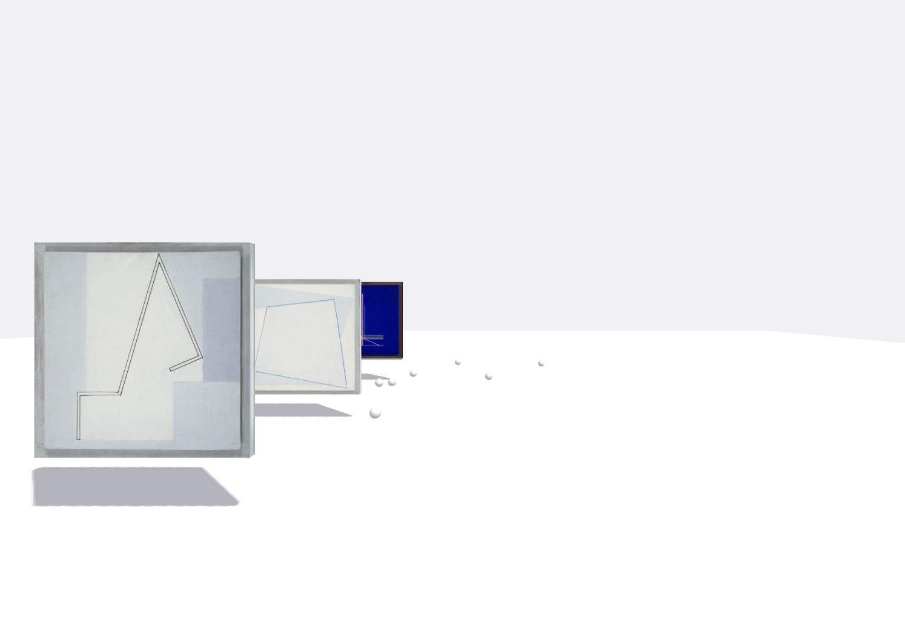
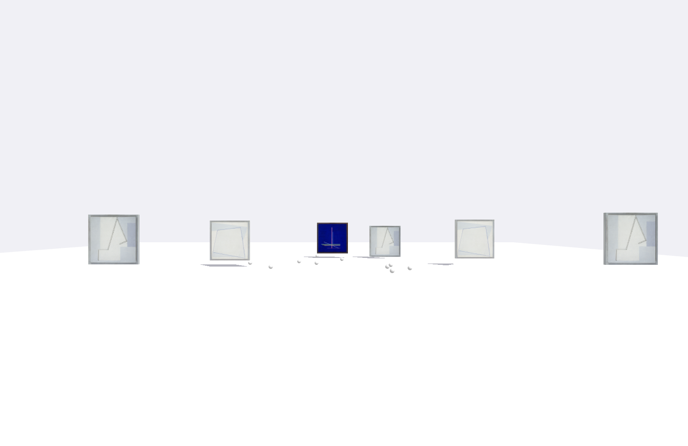

Galeria prezentowana w czasie rzeczywistym
=

Spis treści
==

0. Inicjalizacja biblioteki
1. Dodanie oka kamery
2. Dodanie płaszczyzny podłoża
3. Obsługa ruchu
4. Dodanie "ramki obrazu" (prostopadłościan)
5. Obsłga ładowania tekstur
6. Animacja lewitujacych ramek
7. Możliwość budownia ramek za pomocą klawiszy `1`, `2`, `3`

Demo
==

[/demo/index.html](demo)

Screenshots
==

Credits
==

AZ 2024
inspired by PZ@XFNG
